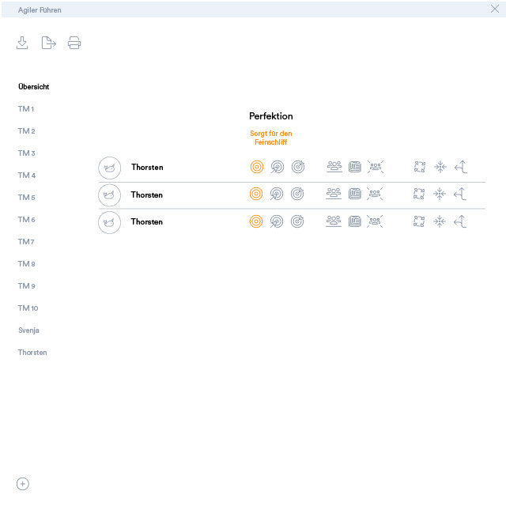
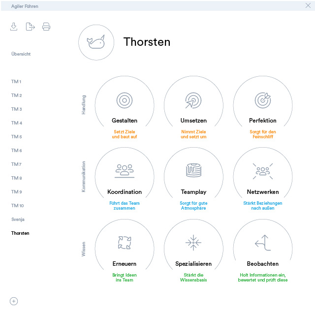
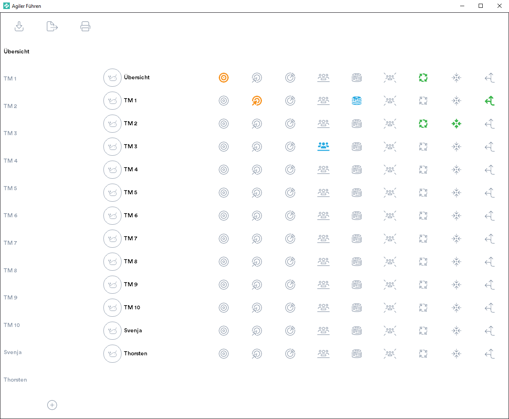

# Teamplanner

Übung zum Start in Python. Mit dem Somersemester 2022 habe ich mich das erste Mal an Python gesetzt.
Nach einigen Umwegen über Tkinter habe ich das Projekt erst in PyQt5 und nun auf PyQt6.3 angelegt.

# Konzeptidee
## Hintergrund
Ich studiere an der HSD im zukünftigen Fachbereich ZDD im ersten Semester des neuen Masterstudiengangs TRADY.
Unsere Kurse sind zusammengesetzt aus verschiedenen Themen der 21st Century Skills: Communication, Collaboration,
Creativity, Critical Thinking, sowie Digital Literacy, Digital Transformation und Concepts of Leadership.

Ein Aspekt des Kurses "Concepts of Leadership 1" war eine Analyse von verschiedenen Aspekten, wie sie Leadership 
verändert. Weg von klassischer Anweisungen einzelner Führungspersonen, hin zu agilen Entscheidungen, deren Kern 
der Nutzen für den Kunden darstellt und damit das Unternehmen vorantreibt.

Die Selbstorganisation von Teams im agilen Management ist jedoch kein Selbstläufer. Einzelne Personen übernehmen
abhängig ihrer Kompetenzen innerhalb eines Projektes verschiedene Rollen, die sie ausfüllen. Im analysierten
Fachbuch "Agiler Führen" geht die Autorin Svenja Hofert nicht nur auf die Theorie hinter der Thematik ein, sondern
gibt verschiedene Tools an die Hand, die eine gezielte Planung und Koordination ermöglichen.

Da ich studierter Kommunikationsdesigner bin und Vorerfahrungen in modernem JavaScript habe, waren besonders die
Tabellen eines Planungstools Anstoß zum Redesign. Für den Kurs "Digital Literacy 1", hatten wir neben einem Referat
zum Thema "Privacy und Dark Pattern" die Aufgabe uns in Python einzuarbeiten.

## Technik
Aufgrund der vielen Parallelen zwischen Python und JavaScript (ECMAScript 2022) startete ich damit, dass ich
alles von Python lernen wollte, was mir innerhalb von einem Semester möglich ist und setzte mir das Ziel
in einer GUI mein Redesign umzusetzen.

Meine erste Wahl fiel auf Tkinter, womit ich zwar gut zurechtkam, jedoch besonders in meiner Rolle als Designer 
vom Framework durch die Limitierung auf Systemschriften ziemlich enttäuscht war. Da mein Plan war, die Icons
von Font Awesome als Schriftdatei einzubetten, musste ein anderes Framework für die GUI her. Frühere Recherchen
brachten mich auf Qt, als eines der führenden GUI-Frameworks im Application-Bereich.

Somit tastete ich mich in mir bekannten Bereichen meiner früheren Ausbildung als Informationstechnischer Assistent
vor und fing an mit Funktionen, dann Klassen und der Aufteilung des Codes in verschiedene Dateien, gelagert in
Unterordnern. Das Google Colab Python-Notebook geriet rasch ans Limit, wodurch ich nach einer passenden IDE
recherchierte. Fündig wurde ich bei JetBrains PyCharm. Da ich schon JetBrains WebStorm nutze, war der Aufwand
die Lücken des Wissenstransfers zu schließen gering und ich konnte Dank anständiger IDE die Geschwindigkeit
maximieren.

## Interface
Die grobe Skizze für mein Interface erstellte ich in Illustrator, da sie für den Projektstart nur zwei 
View-Templates umfasst. Sollte ich das Projekt noch um andere Aspekte erweitern, werde ich langfristig
wahrscheinlich auf XD portieren.

Das Interface basiert auf zwei Hauptbereichen. Einmal der Navigation auf der linken Seite und einmal 
dem Inhalt auf der rechten Seite. Die Navigation unterteilt sich in Toolbar, Liste der Teammitglieder
und dem Metabereich. In der Toolbar kann man Projektdateien speichern, als PDF exportieren, oder den
Druck anweisen. Der Metabereich unten wird genutzt, um Mitglieder hinzuzufügen.

Die Hauptansicht (Central Widget) wird als Router zwischen den Ansichten genutzt.

### Übersicht

Die Übersicht ist angelegt als Auflistung, ähnlich der klassischen Linientabelle von Frau Hofert.
Sie beinhaltet neben dem zugehörigen Avatar den Namen eines Projektmitglieds, sowie die neun 
unterschiedlichen Stärken, mit denen sich Personen ins Team einbringen können, jeweils gruppiert
zu drei Hauptbereichen. Bei einer Markierung wird das entsprechende Icon passend zur Kategorie
eingefärbt. Beim MouseOver wird per Text angezeigt, um was für einen Skill es sich handelt.

### Details

Wenn der Benutzer einen Namen in der Navigation als anwählt (PushButton), dann wird die derzeitige
Ansicht des CentralWidget aus der Layout-Liste gelöscht und durch die Detail-Ansicht ersetzt.

Hier sieht man ausführlich, welche Skills das gewählte Teammitglied nach eigener, sowie Einschätzung
der anderen Mitglieder dem Projekt beisteuern kann. Die Kreise sollen, je nach Anzahl der Markierungen,
mit einer breiten kreisförmigen Progressbar aufgefüllt werden.

### Zeichen und Farben
Die Icons gruppieren sich in drei Themen. "Handlung", "Kommunikation", und "Wissen". Dementsprechend sind
sie nach der Farbenlehre durch Orange für Aktivität, Blau für Vertrauen und Grün für Wissen gekennzeichnet. 
Ebenfalls ist ihre Erscheinung passend zur Gruppe aufgeteilt, in eine Zielscheibe, ggf. mit Pfeil, für
zielorientierte Rollen. Menschen symbolisieren die Kommunikationsrollen; einzig ausgeschlossen vom Teamplay,
welches etwas spielerischer Pancaces darstellt. Rollen, die auf Fachwissen basieren, werden durch 
richtungslenkende Pfeile ausgezeichnet.

# Umsetzung

## GUI

Die Umsetzung fiel mir besonders durch die fehlende Erfahrung mit Qt schwer, da ich mich mit dem
Layout-Modell von Qt noch nicht anfreunden konnte. Obwohl die übergelagerte Gesamtstruktur verständlich  
ist, komme ich mit den H-, sowie V-BoxLayouts noch nicht klar.

### Derzeitiger Stand

Gestartet habe ich mit der Übersichtseite. Die nächsten Schritte der GUI sind ein besseres Verteilen
der Abstände zwischen Einträgen, sowie eine gruppierte Verteilung der Skills.

## Code

### Logging
Um Informationen über den Zustand des Programms zu erhalten werden Informationen in einer Datei geloggt.
Logs werden in der "./teamplanner.log" gespeichert.

### Configparser
Ziel ist die vollständige Konfigurierbarkeit in einer externen Datei aufzubewahren.
Angaben werden momentan in der "./config.ini" gespeichert.

### SQLite3 (In Vorbereitung)
Informationen über Nutzer sollen in einer lokalen Datenbank "./db.sqlite" hinterlegt werden.
Vorbereitungen dafür finden sich in der overview.py

### Ctypes
Um in Windows das Fenster-Icon auch in der Taskbar anzeigen zu können, musste ein Identifier in der "./main.py" 
gesetzt werden.

### Stylesheet
PySide6 (Qt für Python) unterstützt externe Stylesheets, welche nahezu wie CSS aufgebaut sind.
Unter "./assets/themes/stylesheet.qss" werden verschiedene Module visuell angepasst.
Properties werden per TAG[Property] angesteuert; Objektnamen mit TAG#name.

## Status und Lernkurve

### Viele Bereiche sind noch in Vorbereitung!
"./classes/core/project.py" ist beispielsweise eine solche Datei. Klasse angelegt, schon erste Tests bzgl. 
Dialogfenster zur Dateienauswahl abgeschlossen. Aber noch vieles zu erledigen.

### Start
Python: 3 % - Qt: 2%

### Abgabe
Python: 65 % - Qt: 15 % 

### Das Projekt wird in den kommenden Wochen spaßeshalber vervollständigt.
